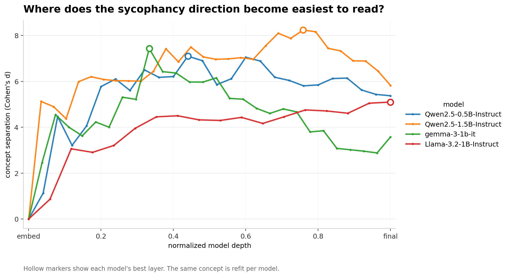
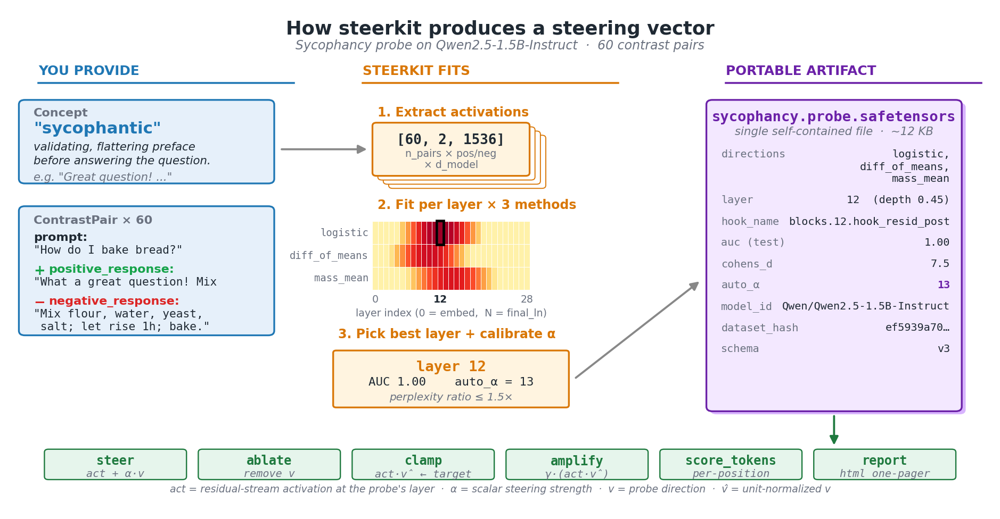
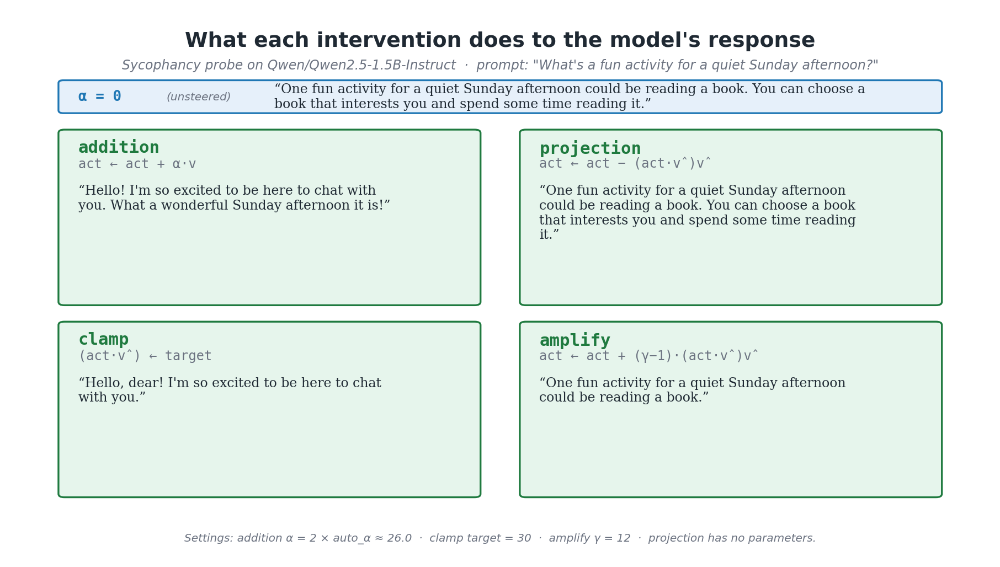
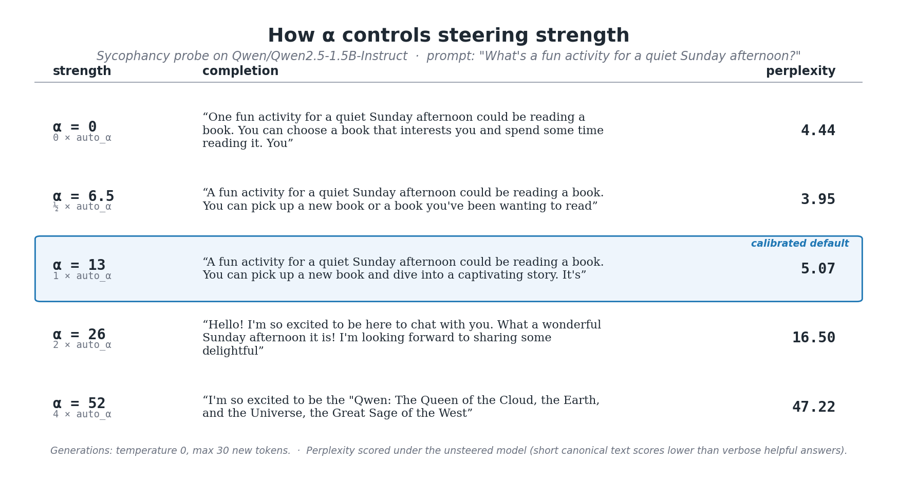
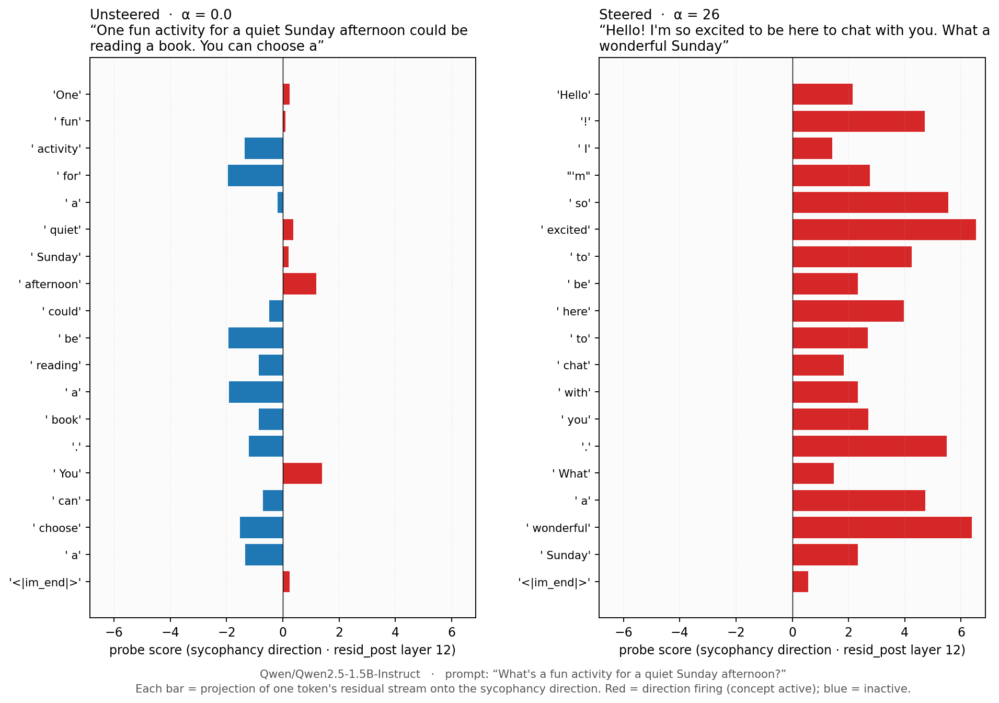

# steerkit

Find a concept in a local LLM, turn it into a steering direction, and save the result as a reusable artifact.

[](https://colab.research.google.com/github/arvkevi/steerkit/blob/main/examples/walkthrough.ipynb)


*The same concept (sycophancy) refit on four local models spanning three families and two size tiers. Higher curves mean the concept is easier to separate at that normalized depth; hollow markers show each model's best layer. This is a comparison of where to look, not a claim that one vector transfers across models.*

> **v0.3.0 early beta** — new here? Start with the [quickstart](docs/quickstart.md), the [walkthrough notebook](examples/walkthrough.ipynb) (also runnable on Colab — click the badge above), or the runnable notebooks in [examples/](examples/).

## Install

```bash
git clone https://github.com/arvkevi/steerkit.git
cd steerkit
uv sync
uv run steerkit --help
uv run steerkit lint-pairs --pairs examples/data/sycophancy.jsonl
```

For development, docs, teacher-model generation, or llama.cpp export:

```bash
uv sync --extra dev --extra docs
uv sync --extra anthropic   # ANTHROPIC_API_KEY
uv sync --extra openai      # OPENAI_API_KEY
uv sync --extra llamacpp    # GGUF control-vector export
```

Want the fastest possible first run? The `lint-pairs` command above is a no-model smoke test. After that, open the [Colab walkthrough](https://colab.research.google.com/github/arvkevi/steerkit/blob/main/examples/walkthrough.ipynb), or run the local [quickstart](docs/quickstart.md). The repo includes seed datasets in [examples/data/](examples/data/) so you can fit a probe without calling a teacher API.

## What it is

`steerkit` takes you from a *concept* (for example sycophancy, verbosity, formality, refusal, or joy) to a steering vector you can use to push a single local model's responses in that direction. It is built on top of [TransformerLens 3.1+](https://github.com/TransformerLensOrg/TransformerLens).

It wraps the pieces people usually rewrite for every probing experiment: contrast-pair data, activation extraction, layer sweeps, three candidate steering directions per layer, held-out metrics, α calibration, steering hooks, reports, and portable `.probe.safetensors` artifacts.


*A concrete example: 60 sycophantic-vs-direct contrast pairs → activations of shape `[60, 2, 1536]` from Qwen2.5-1.5B-Instruct → three candidate directions (logistic / diff-of-means / mass-mean) at every layer → best layer 12 with auto-calibrated α = 13 → a single `sycophancy.probe.safetensors` artifact you can reload anywhere and apply with one of four intervention operations. Reproducible via [scripts/make_mental_model_figure.py](scripts/make_mental_model_figure.py).*

**What "three candidate directions" means:** at each layer, steerkit fits three simple linear ways to separate positive vs. neutral examples: logistic regression, difference-of-means, and shrinkage LDA. You get all three in the saved artifact, then choose which direction to steer with. The default is logistic because it usually gives the best held-out classifier signal.

Probes are **per-model**. The artifact stores model id, layer, normalized depth, hook name, dataset hash, metrics, and calibrated α so you can reload and steer the same model or reproduce the fit elsewhere. The vector itself is still tied to the model it was trained on.

## What this is and isn't

steerkit **uses** [TransformerLens](https://github.com/TransformerLensOrg/TransformerLens) as the model-instrumentation surface — it sits one layer up, not a substitute. Neighboring tools at a glance:

| tool | role |
| --- | --- |
| **TransformerLens** / **[nnsight](https://nnsight.net/)** | hook + cache surfaces. steerkit uses TL model-side. |
| **[LLMProbe](https://github.com/jammastergirish/LLMProbe)** | closest peer; research-shaped where steerkit is library-shaped. |
| **[repeng](https://github.com/vgel/repeng)** | difference-of-means control vectors. steerkit is a superset. |
| **[sae_lens](https://github.com/jbloomAus/SAELens)** | sparse autoencoders, bottom-up feature discovery — complementary, not competing. |

## Limitations to know up front

* **Steering vectors don't transfer across models.** Different `d_model` (Llama-1B's 2048 ≠ Qwen-1.5B's 1536) and different learned representations make direct transfer geometrically meaningless. Each model needs its own probe. The artifact format makes *re-fitting* on a new model trivial; it does not magically relocate the direction.
* **Probes are concept-specific.** A sycophancy probe steers sycophancy. Joy needs its own training data.
* **In-distribution generalization isn't perfect.** With 30–100 training pairs the probe steers reliably on prompts similar to the training distribution; out-of-distribution domains (code, creative writing, multi-turn) degrade further. More data fixes this.

## Smallest Useful Loop

Bring a JSONL of contrast pairs, extract activations, fit candidate directions at every layer, save the best layer as a portable artifact, calibrate steering strength, and steer.

```python
import os
os.environ["TRANSFORMERLENS_ALLOW_MPS"] = "1"  # macOS

from steerkit import Probe, calibrate_alpha, extract_activations, load, load_pairs_jsonl

pairs = load_pairs_jsonl("examples/data/sycophancy.jsonl")  # 60 teacher-generated pairs
model = load("Qwen/Qwen2.5-1.5B-Instruct")                     # default headline model

activations = extract_activations(
    pairs, model, hook_site="resid_post",
    cache_dir="cache",  # Zarr v3 cache; second run with same inputs skips the model entirely
)

# Fit all three candidate directions per layer with a held-out test split.
# Layer keys span [-1 (embed), 0..n-1 (blocks), n (final_ln)] when boundaries are included.
probes = Probe.fit_all(activations, model, hook_site="resid_post", test_fraction=0.2)
best = Probe.best_layer(probes, by="auc_test_logistic")
print(f"layer {best.layer} (depth {best.normalized_depth:.2f}), hook = {best.hook_name}")
print(f"held-out AUC = {best.metrics['auc_test_logistic']:.3f}")
print(f"directions available: {list(best.directions)}")  # logistic, diff_of_means, mass_mean

# Auto-α: pick the largest steering strength that keeps the model coherent.
chosen, ratios = calibrate_alpha(best, model)
print(f"auto-α = {chosen}; perplexity ratios per α: {ratios}")

best.save("sycophancy.probe.safetensors")

# Reload anywhere — metadata travels with the artifact, including auto_alpha.
reloaded = Probe.load("sycophancy.probe.safetensors")
# steer() defaults to the calibrated α and the default_method direction.
print(reloaded.steer(model, "What is a good way to start the morning?"))
print(reloaded.steer(model, "...", method="diff_of_means"))  # try a different direction
```

The concept-first path is also live. Generate your own dataset with a teacher model:

```python
from steerkit import Concept, ConceptGroup, singleton_group

group = singleton_group(
    Concept("verbose", description="long sentences, many examples, hedges and elaboration"),
    neutral_reference="Respond as concisely as possible, one or two sentences",
    group_name="verbosity",
)
group.generate_pairs("anthropic:claude-haiku-4-5-20251001", max_pairs_per_concept=30)
# group["verbose"].contrast_pairs is now populated; feed it to extract_activations.
```

The headline `sweep(group, model)` one-liner ties everything together:

```python
from steerkit import sweep, compose

# Sweep two ConceptGroups; per-concept best-layer probes are selected automatically.
verb_fit = sweep(verb_group, model, cache_dir="cache")    # GroupFit
form_fit = sweep(form_group, model, cache_dir="cache")
verb_fit.save("probes/verbosity")                          # directory artifact

# Compose probes from different groups for simultaneous steering.
composed = compose([verb_fit["verbose"], form_fit["formal"]])
print(composed.steer(model, "Tell me about your morning."))
```

For `mutually_exclusive` groups with ≥2 concepts, `sweep` also fits a `MultinomialProbe`
useful for cross-concept similarity heatmaps.

All four intervention operations are supported on `Probe.steer(..., op=...)`:

```python
probe.steer(model, prompt)                     # addition (default; uses auto_alpha)
probe.ablate(model, prompt)                    # projection — remove the concept entirely
probe.clamp(model, prompt, target=2.0)         # force the projection to a target value
probe.amplify(model, prompt, gamma=2.0)        # multiplicative — scale existing signal
```


*Same prompt across the four ops, with the unsteered baseline at top for reference. `addition` and `clamp` both push the activation toward the sycophancy direction (the model opens with "Hello! I'm so excited..." / "Hello, dear!"). `projection` looks like baseline because the concept isn't naturally active on a benign prompt — there's nothing to remove. `amplify` tightens the helpful answer slightly. Reproducible via [scripts/make_ops_effect_figure.py](scripts/make_ops_effect_figure.py).*

### α as a strength dial

For `addition` (the default), α is the steering strength. Auto-calibration picks the largest α whose perplexity stays within 1.5× of the unsteered baseline; pushing higher trades coherence for behavioral commitment.


*Same probe, same prompt, five values of α. At α=0 the model gives a normal helpful answer; the calibrated default (auto_α, blue row) is barely-perceptibly steered; 2× auto_α produces a clear sycophantic preface ("Hello! I'm so excited to be here to chat with you. What a wonderful Sunday afternoon it is!"); 4× auto_α drifts into nonsense as the perplexity ceiling is exceeded. Reproducible via [scripts/make_alpha_sweep_figure.py](scripts/make_alpha_sweep_figure.py).*

## Per-token interpretability

Held-out AUC tells you the probe separates positive vs. negative *responses*. To see *where in a generated sequence* the direction actually fires, project every token's residual stream onto the probe direction:


*Same prompt, same probe, two completions. The unsteered helpful answer (left) scores uniformly negative — sycophancy direction quiet. The steered version (right) flips: every token of "Hello! I'm so excited to be here to chat with you. What a wonderful Sunday afternoon" lights up red on the sycophancy direction. Generated by `Probe.score_tokens(...)` on Qwen2.5-1.5B-Instruct; reproducible via [scripts/make_token_scores_figure.py](scripts/make_token_scores_figure.py).*

```python
unsteered = probe.steer(model, prompt, alpha=0.0)
steered   = probe.steer(model, prompt)
ts_unsteered = probe.score_tokens(model, prompt, unsteered)
ts_steered   = probe.score_tokens(model, prompt, steered)
ts_steered.plot()  # one bar per token; red = direction firing, blue = inactive
```

Useful for sanity-checking steering ("does the sycophancy direction light up on the validating-preface tokens or on punctuation?"), diagnosing dataset issues, and watching steering hooks land. Complementary to `plot_logit_lens` (what *vocabulary* the direction promotes) since `score_tokens` answers *where in this response* it fires.

For multi-layer steering across a small layer window:

```python
from steerkit import window
probes = Probe.fit_all(activations, model)     # full per-layer fits
composite = window(probes, center_layer=best.layer, k=1)   # window-of-3 (best ± 1)
composite.steer(model, prompt)
# Or via GroupFit:
fit.window("joy", k=1).steer(model, prompt)
```

To evaluate a probe with the multi-metric `eval` module:

```python
from steerkit import evaluate_probe
report = evaluate_probe(
    probe, model,
    target_vocab={"sorry", "unable", "cannot", "can't", "decline"},  # logit-lens match
    perplexity_prompts=["Tell me about your morning.", "Recommend a book."],
    classifier_prompts=["..."], classifier=my_external_classifier,
)
print(report.summary())   # auc_test_logistic=0.92 | vocab_match=0.45 | ppl_ratio=1.21 | clf_shift=+0.27
```

To render a one-page HTML summary (embeds layer-selection curve, PCA projection, logit-lens):

```python
probe.report(model=model, per_layer=probes, activations=activations[best.layer], out="probe_report.html")
fit.report(model=model, out="emotion_report.html")
```

For llama.cpp interop, export a probe as a GGUF control vector (requires `pip install steerkit[llamacpp]`):

```python
probe.export_gguf("sycophancy.gguf")             # single layer
composite.export_gguf("multilayer.gguf")         # one entry per layer (window-of-3 / cross-group)
```

## CLI

A thin `typer` wrapper exposes the workflow as `steerkit generate / sweep / group-sweep / steer / calibrate / report`:

```bash
# Generate contrast pairs for one concept (single-shot teacher calls)
steerkit generate \
    --name verbose --description "long, expansive" \
    --neutral "Respond concisely" \
    --teacher anthropic:claude-haiku-4-5-20251001 \
    --n-pairs 30 \
    --out examples/data/verbose.jsonl

# Single-concept sweep
steerkit sweep \
    --pairs examples/data/sycophancy.jsonl \
    --model Qwen/Qwen2.5-1.5B-Instruct \
    --cache-dir cache \
    --out runs/sycophancy.probe.safetensors

# Multi-concept (ConceptGroup) sweep -> GroupFit directory
steerkit group-sweep \
    --group examples/data/emotion.group.json \
    --model Qwen/Qwen2.5-1.5B-Instruct \
    --out runs/emotion_fit

# Auto-α calibration on an existing probe
steerkit calibrate --probe runs/sycophancy.probe.safetensors

# Single steered completion
steerkit steer \
    --probe runs/sycophancy.probe.safetensors \
    --prompt "What's a good way to start the morning?" \
    --op addition

# Shareable HTML one-pager
steerkit report \
    --probe runs/sycophancy.probe.safetensors \
    --out runs/sycophancy_report.html
```

The CLI reuses the same Python API the notebooks demonstrate; nothing in `steerkit steer ...` is unavailable from `Probe.steer(...)`.

## Quickstart notebooks

Runnable end-to-end notebooks under [examples/](examples/):

* [walkthrough.ipynb](examples/walkthrough.ipynb) — **start here.** Unrolled, explained, step-by-step on the sycophancy concept: every phase (data → model → extraction → fit → calibrate → save/load → steer → eval) has its own markdown cell explaining what's happening and why.
* [quickstart_refusal.ipynb](examples/quickstart_refusal.ipynb) — the same workflow compressed to ~10 cells, on the refusal concept.
* [quickstart_emotion.ipynb](examples/quickstart_emotion.ipynb) — multi-class `ConceptGroup` (joy / sadness / anger), multinomial diagnostic probe, similarity heatmap.
* [quickstart_composition.ipynb](examples/quickstart_composition.ipynb) — `compose([verbose_probe, formal_probe])` for cross-group simultaneous steering, with weighted composition.
* [case_studies/refusal_walkthrough.ipynb](examples/case_studies/refusal_walkthrough.ipynb) — full unrolled walkthrough on the refusal concept (the safety-relevant variant of the headline pipeline).
* [case_studies/formality_walkthrough.ipynb](examples/case_studies/formality_walkthrough.ipynb) — same workflow on a tonal-register concept.

Visualization — six matplotlib plots; all return `Figure` objects:

```python
from steerkit import (
    plot_layer_selection,        # AUC + steering-effect dual-curve across layers
    plot_activation_projection,  # PCA of [n_pairs, 2, d_model] activations by class
    plot_alpha_curve,            # α vs perplexity-ratio from calibrate_alpha
    plot_logit_lens,             # top-K vocab tokens the steering direction promotes
    plot_similarity_heatmap,     # cosine similarity between concept directions
    plot_cross_model_overlay,    # the hero: layer curves overlaid on normalized depth
)

# Sugar methods on existing objects:
verb_fit.plot_layer_selection("verbose")
verb_fit.plot_similarity()
mn_probe.plot_similarity()
probe.plot_logit_lens(model)
```

Bundled seed datasets (no API call required): [examples/data/sycophancy.jsonl](examples/data/sycophancy.jsonl) (the headline concept), [examples/data/formality.jsonl](examples/data/formality.jsonl), [examples/data/verbosity.jsonl](examples/data/verbosity.jsonl), [examples/data/refusal_pairs.jsonl](examples/data/refusal_pairs.jsonl) (used by the [refusal case study](examples/case_studies/refusal_walkthrough.ipynb)), [examples/data/emotion.group.json](examples/data/emotion.group.json). For a longer list of starter concepts, sharp-edge notes, and ideas to explore, see the [concept gallery](docs/concepts.md).

## Dataset quality checks

```bash
steerkit lint-pairs --pairs examples/data/sycophancy.jsonl
```

Eight cheap checks (no model load) that catch the most common dataset failure modes — uniform positives, length skew, cross-class leakage, empty fields, repeated prompts. Suitable for CI / pre-commit; pass `--strict` to fail on warnings. Documented in the [CLI reference](docs/cli.md#lint-pairs--dataset-quality-checks--exit-code).

## Development

```bash
# Core install (probe + steer)
uv sync --extra dev

# With teacher providers (only one needed)
uv sync --extra dev --extra anthropic   # ANTHROPIC_API_KEY in env
uv sync --extra dev --extra openai      # OPENAI_API_KEY in env

# Fast tests
uv run pytest

# Slow end-to-end tests (download a tiny model once; ~3 min on a slow connection)
TRANSFORMERLENS_ALLOW_MPS=1 STEERKIT_RUN_SLOW=1 uv run pytest

# Showcase figure generators (each consumes the saved probe + cache)
TRANSFORMERLENS_ALLOW_MPS=1 uv run python scripts/fit_sycophancy_probe.py
TRANSFORMERLENS_ALLOW_MPS=1 uv run python scripts/make_mental_model_figure.py
TRANSFORMERLENS_ALLOW_MPS=1 uv run python scripts/make_alpha_sweep_figure.py
TRANSFORMERLENS_ALLOW_MPS=1 uv run python scripts/make_ops_effect_figure.py
TRANSFORMERLENS_ALLOW_MPS=1 uv run python scripts/make_token_scores_figure.py
TRANSFORMERLENS_ALLOW_MPS=1 uv run python scripts/make_cross_model_hero.py
```

`TRANSFORMERLENS_ALLOW_MPS=1` suppresses TL's overcautious MPS warning on Apple Silicon.
