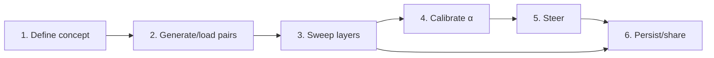

# Workflow walkthrough

The steerkit workflow has six logical stages. You can run the whole loop or stop after any stage.



The core idea is deliberately simple: compare concept-bearing responses against neutral responses on the same prompts, find the layer where those two classes separate cleanly, then use that direction as a steering hook.

## 1. Define a concept

```python
from steerkit import Concept, ConceptGroup, singleton_group

# Single-concept (binary) — wrap in singleton_group:
group = singleton_group(
    Concept("verbose", description="long, expansive language"),
    neutral_reference="Respond as concisely as possible",
    group_name="verbosity",
)

# Multi-concept (mutually exclusive):
emotion = ConceptGroup(
    name="emotion",
    relationship="mutually_exclusive",
    neutral_reference="Respond plainly with no emotion",
    concepts=[Concept("joy", "..."), Concept("sadness", "..."), Concept("anger", "...")],
)
```

The `relationship` flag drives downstream behavior:

- `mutually_exclusive` — multinomial probe valid; diagnostic heatmap is meaningful.
- `multi_label` — concepts can co-occur; only per-concept binary probes are produced.
- `axes` — concepts are orthogonal axes (e.g. emotion × formality); typically each axis is its own group, with cross-group composition at steer time.

## 2. Generate (or load) contrast pairs

```python
group.generate_pairs("anthropic:claude-haiku-4-5-20251001", max_pairs_per_concept=30)
# -- or --
from steerkit import load_pairs_jsonl
pairs = load_pairs_jsonl("my_pairs.jsonl")
```

The teacher spec format is `provider:model` (e.g. `local:HuggingFaceTB/SmolLM2-1.7B-Instruct`). Anthropic + OpenAI auto-load the SDK from optional extras and read API keys from environment variables (`ANTHROPIC_API_KEY`, `OPENAI_API_KEY`).

## 3. Sweep + select best layer

```python
from steerkit import sweep
fit = sweep(group, model, cache_dir="cache")    # GroupFit
fit["joy"]                                       # best Probe for the joy concept
fit.multinomial                                  # MultinomialProbe (mutex groups only)
```

The cheap tier always runs. At every layer, steerkit fits three candidate linear directions:

- `logistic` — logistic regression with L2 regularization; usually the default steering direction.
- `diff_of_means` — the average positive activation minus the average neutral activation.
- `mass_mean` — shrinkage LDA, useful when dimensionality is high and the dataset is small.

Each layer gets held-out AUC metrics plus Cohen's d for the logistic score. The expensive tier is opt-in:

```python
fit = sweep(group, model, cache_dir="cache", with_steering_eval=True, teacher=teacher)
```

This invokes the LLM judge on the top-K candidate layers per concept and writes `metrics["steering_effect"]` on each.

## 4. Calibrate α (optional)

```python
from steerkit import calibrate_alpha
chosen, ratios = calibrate_alpha(fit["joy"], model)
```

Sweeps α candidates and picks the largest where steered-output perplexity stays within a 1.5× ratio of unsteered. Result attaches to `probe.auto_alpha` and is the default when `Probe.steer(..., alpha=None)`.

## 5. Steer

```python
probe.steer(model, prompt)                      # uses auto_alpha
probe.ablate(model, prompt)                     # remove the concept
probe.clamp(model, prompt, target=2.0)          # force projection to 2.0
probe.amplify(model, prompt, gamma=2.0)         # scale existing signal

# Cross-group composition:
from steerkit import compose
composite = compose([fit_a["x"], fit_b["y"]], weights=[0.7, 0.3])
composite.steer(model, prompt)

# Multi-layer window-of-(2k+1):
from steerkit import window
window_composite = window(fit.per_concept["joy"], center_layer=fit["joy"].layer, k=1)
window_composite.steer(model, prompt)
```

## 6. Persist + share

```python
fit["joy"].save("joy.probe.safetensors")        # one self-contained file
fit.save("emotion_fit/")                         # whole GroupFit as a directory

# HTML one-pager (embedded PNGs):
fit.report(model=model, out="report.html")

# llama.cpp gguf control vector:
probe.export_gguf("joy.gguf")
```

The `.probe.safetensors` file is portable: the embedded JSON metadata identifies the source model, hook site, layer (absolute + normalized depth), default method, calibrated α, and dataset hash. Reload anywhere with `Probe.load(path)`.
